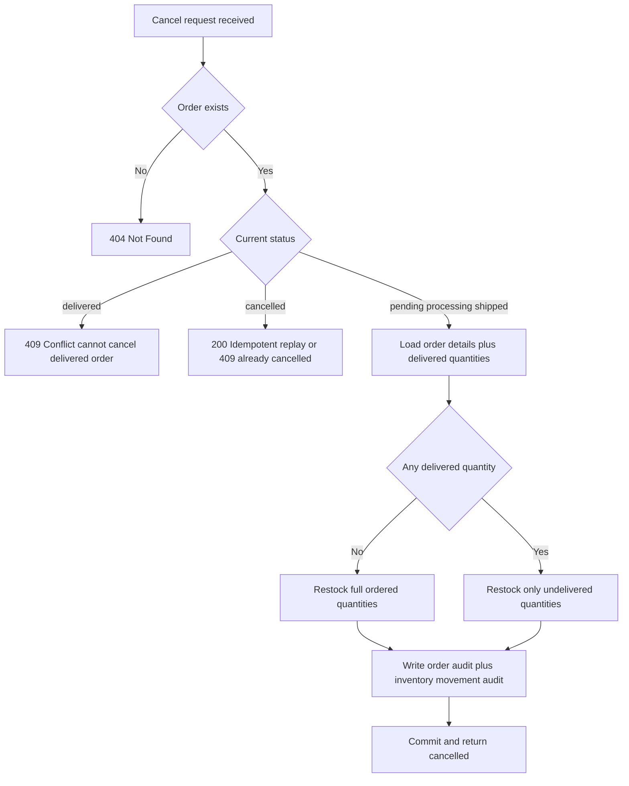

# Research: Order and Product Model Structure
## OctoCAT Supply Chain Management Application
**Date:** May 22, 2026  
**Scope:** Current order/product model architecture, status handling patterns, and validation approaches

---

## Executive Summary

This research examines the current order and product model structure in the OctoCAT Supply Chain Management application. The system uses TypeScript interfaces for models with in-memory data structures (no active ORM). Current order status transitions follow a simple linear model with five states: `pending → processing → shipped → delivered / cancelled`. The Product model includes a `stockLevel` field but it is not currently reflected in the interface definition. No formal validation, transaction handling, or status transition guards are implemented.

---

## Evidence Log

### 1. Order Model Structure

**File:** [api/src/models/order.ts](api/src/models/order.ts)  
**Lines:** [1-37](api/src/models/order.ts#L1-L37)

#### Key Findings:

The Order interface defines these properties:
- `orderId` (number) - Required, unique identifier
- `branchId` (number) - Required, references Branch
- `orderDate` (string) - Required, ISO date-time format
- `name` (string) - Order name/title
- `description` (string) - Order description
- `status` (string) - Current order state

**Status Enum Values (from Swagger documentation, line 25):**
```typescript
enum: [pending, processing, shipped, delivered, cancelled]
```

**Current Status Usage in Data (seedData.ts):**
- Line 211: `status: "pending"`
- Line 219: `status: "processing"`
- Line 259: `status: "pending"`

**Code Snippet:**
```typescript
export interface Order {
    orderId: number;
    branchId: number;
    orderDate: string;
    name: string;
    description: string;
    status: string;
}
```

**Observations:**
- Status field is typed as generic `string` (not enum for type safety)
- Only two distinct status values observed in seed data: `pending` and `processing`
- No `shipped`, `delivered`, or `cancelled` states currently in use
- No timestamp fields for status transitions (e.g., `statusChangedAt`, `processedAt`, `shippedAt`)

---

### 2. OrderDetail Model Structure

**File:** [api/src/models/orderDetail.ts](api/src/models/orderDetail.ts)  
**Lines:** [1-35](api/src/models/orderDetail.ts#L1-L35)

#### Key Findings:

The OrderDetail interface creates line items for orders:
- `orderDetailId` (number) - Required, unique identifier
- `orderId` (number) - Required, foreign key to Order
- `productId` (number) - Required, foreign key to Product
- `quantity` (number) - Required, item count
- `unitPrice` (number) - Required, price per unit at time of order
- `notes` (string) - Optional notes

**Code Snippet:**
```typescript
export interface OrderDetail {
    orderDetailId: number;
    orderId: number;
    productId: number;
    quantity: number;
    unitPrice: number;
    notes: string;
}
```

**Seed Data (seedData.ts, lines 223-246):**
```typescript
orderDetails: OrderDetail[] = [
    {
        orderDetailId: 1,
        orderId: 1,
        productId: 2,
        quantity: 5,
        unitPrice: 199.99,
        notes: "AutoClean Litter Domes for new cat café locations"
    },
    {
        orderDetailId: 2,
        orderId: 1,
        productId: 3,
        quantity: 5,
        unitPrice: 89.99,
        notes: "CatFlix Entertainment Portals for waiting areas"
    },
    {
        orderDetailId: 3,
        orderId: 2,
        productId: 4,
        quantity: 20,
        unitPrice: 79.99,
        notes: "PawTrack Smart Collars for adoption events"
    }
];
```

**Observations:**
- No aggregated totals (line subtotal = quantity × unitPrice)
- No delivery tracking link (directly references Order, not linked to Delivery)
- `unitPrice` captured at order time (historical pricing pattern)
- No back-reference to know how much of quantity has been delivered

---

### 3. Product Model Structure

**File:** [api/src/models/product.ts](api/src/models/product.ts)  
**Lines:** [1-45](api/src/models/product.ts#L1-L45)

#### Key Findings:

The Product interface includes inventory and pricing fields:
- `productId` (number) - Required, unique identifier
- `supplierId` (number) - Required, foreign key to Supplier
- `name` (string) - Required
- `description` (string) - Required
- `price` (number) - Required, current price
- `sku` (string) - Stock Keeping Unit
- `unit` (string) - Unit of measure (e.g., "piece")
- `imgName` (string) - Image filename reference
- `discount` (number, optional) - Discount as decimal (e.g., 0.25 for 25%)

**⚠️ CRITICAL FINDING: `stockLevel` declared in Swagger but NOT in TypeScript interface**

Swagger documentation (line 30-31):
```yaml
stockLevel:
  type: integer
  description: Current stock level of the product
```

TypeScript interface (lines 33-43): No `stockLevel` property

**Code Snippet (TypeScript Interface):**
```typescript
export interface Product {
    productId: number;
    supplierId: number;
    name: string;
    description: string;
    price: number;
    sku: string;
    unit: string;
    imgName: string;
    discount?: number;
}
```

**Seed Data (seedData.ts, lines 36-154):**
```typescript
products: Product[] = [
    {
        productId: 1,
        supplierId: 3,
        name: "SmartFeeder One",
        description: "This AI-powered feeder...",
        price: 129.99,
        sku: "CAT-FEED-001",
        unit: "piece",
        imgName: "feeder.png",
        discount: 0.25
    },
    // 11 more products...
];
```

**Observations:**
- `stockLevel` is NOT in the actual interface, only in Swagger docs (documentation mismatch)
- No stock tracking currently implemented in code
- Discount percentages stored as decimals (0.25 = 25%)
- Some products have discount, others don't (using optional field)
- Multiple products share same supplierId

---

### 4. Order Routes and Endpoints

**File:** [api/src/routes/order.ts](api/src/routes/order.ts)  
**Lines:** [57-177](api/src/routes/order.ts#L57-L177)

#### Available Endpoints:

1. **POST /api/orders** (lines 74-77)
   - Create new order
   - No validation
   - Direct push to in-memory array

2. **GET /api/orders** (lines 79-82)
   - Retrieve all orders
   - Returns all orders without filtering

3. **GET /api/orders/:id** (lines 84-92)
   - Get single order by ID
   - Linear search through array

4. **PUT /api/orders/:id** (lines 94-104)
   - Update entire order
   - No partial update support
   - No validation of status transitions

5. **DELETE /api/orders/:id** (lines 106-114)
   - Delete order
   - Removes from array

**Code Pattern (lines 94-104):**
```typescript
router.put('/:id', (req, res) => {
  const index = orders.findIndex(o => o.orderId === parseInt(req.params.id));
  if (index !== -1) {
    orders[index] = req.body;
    res.json(orders[index]);
  } else {
    res.status(404).send('Order not found');
  }
});
```

**Observations:**
- No dedicated status transition endpoint
- Status changed via generic PUT (entire object replacement)
- No validation of valid status transitions
- No automatic timestamp management
- No transaction/rollback capability

---

### 5. Order Status Handling Patterns

#### Current Implementation:

**Status Values (from model.ts Swagger, line 25):**
```
pending → processing → shipped → delivered
              ↓
           cancelled (from any state)
```

**How Status Transitions Occur:**
- Status transitions via PUT /api/orders/:id with full order replacement
- No enforcement of valid state transitions
- No intermediate state validation
- No audit trail of status changes

**Example from seedData.ts:**
- Order 1: starts as `"pending"` (line 211)
- Order 2: starts as `"processing"` (line 219)
- No mechanism to transition between states observed in current code

#### Missing Patterns:
- ❌ Status transition guards/validators
- ❌ Timestamp tracking for each status change
- ❌ Automatic status updates (e.g., when delivery completes)
- ❌ Event-driven status changes
- ❌ Status history/audit log

---

### 6. Delivery Model and Order-Delivery Relationship

**File:** [api/src/models/delivery.ts](api/src/models/delivery.ts)  
**Lines:** [1-42](api/src/models/delivery.ts#L1-L42)

Delivery interface:
```typescript
export interface Delivery {
    deliveryId: number;
    supplierId: number;
    deliveryDate: string;
    name: string;
    description: string;
    status: string;
}
```

**Delivery Status Values (line 20):**
```
enum: [pending, in-transit, delivered, failed]
```

**OrderDetailDelivery Model (api/src/models/orderDetailDelivery.ts, lines 1-26):**
```typescript
export interface OrderDetailDelivery {
    orderDetailDeliveryId: number;
    orderDetailId: number;
    deliveryId: number;
    quantity: number;
    notes: string;
}
```

**Relationship Flow:**
```
Order → OrderDetail → OrderDetailDelivery → Delivery
  ↓
  └─ Contains 1+ OrderDetails
     └─ Each linked to 1+ OrderDetailDeliveries
        └─ Each linked to 1 Delivery
```

**Observations:**
- Delivery status (`pending, in-transit, delivered, failed`) is independent from Order status
- OrderDetailDelivery tracks partial deliveries (allows splitting quantity across multiple deliveries)
- No automatic Order status update when delivery completes
- No rollback of reserved quantities if delivery fails

---

### 7. Database/ORM Patterns

**File:** [api/src/routes/order.ts](api/src/routes/order.ts)  
[api/src/routes/product.ts](api/src/routes/product.ts)

#### Current Pattern: In-Memory Arrays

All data stored in module-level arrays initialized from seed data:

**Order Route (line 65-66):**
```typescript
let orders: Order[] = [...seedOrders];

router.post('/', (req, res) => {
  const newOrder: Order = req.body;
  orders.push(newOrder);
  res.status(201).json(newOrder);
});
```

**Product Route (line 53-54):**
```typescript
let products: Product[] = [...seedProducts];

router.post('/', (req, res) => {
  const newProduct: Product = req.body;
  products.push(newProduct);
  res.status(201).json(newProduct);
});
```

#### Implementation Details:
- ❌ No database persistence (data lost on server restart)
- ❌ No ORM (Prisma, TypeORM, Sequelize, etc.)
- ❌ No transaction support
- ❌ No locking/concurrency control
- ✅ Simplicity for demo/MVP
- ✅ In-memory operations are fast

#### Data Access Pattern:
- Linear array searches with `.find()` and `.findIndex()`
- No indexing on frequently searched fields (orderId, productId)
- Array mutations with `.splice()` for deletion

**Observation:** This is appropriate for a demo/prototype but would require refactoring to a database for production use.

---

### 8. Validation and Constraints

**Current State:**

No validation found in:
- Order creation (POST /api/orders)
- Order updates (PUT /api/orders/:id)
- Product creation (POST /api/products)
- Product updates (PUT /api/products/:id)

**Example - No Validation (order.ts, lines 74-77):**
```typescript
router.post('/', (req, res) => {
  const newOrder: Order = req.body;
  orders.push(newOrder);  // Accepts any object
  res.status(201).json(newOrder);
});
```

#### Missing Validations:
- ❌ Required field checks (even though interfaces define required fields)
- ❌ Foreign key validation (branchId exists, productId exists)
- ❌ Quantity bounds (positive numbers only)
- ❌ Price validation (non-negative)
- ❌ Status enum validation
- ❌ Duplicate key prevention
- ❌ Referential integrity checks

---

### 9. Data Relationships Summary

#### Foreign Key References:

| Model | References | Current Validation |
|-------|------------|-------------------|
| Order | branchId → Branch | None |
| OrderDetail | orderId → Order | None |
| OrderDetail | productId → Product | None |
| OrderDetailDelivery | orderDetailId → OrderDetail | None |
| OrderDetailDelivery | deliveryId → Delivery | None |
| Delivery | supplierId → Supplier | None |
| Product | supplierId → Supplier | None |

---

### 10. Services Folder Analysis

**File:** [api/src/services/](api/src/services/)

**Status:** Empty folder - no service layer implemented

**Observations:**
- Business logic is directly in route handlers
- No separation of concerns between routing and domain logic
- No reusable service layer
- Makes it difficult to share logic across endpoints

---

## 11. Order Update/Confirmation Endpoints - Comprehensive Analysis

### Order Creation Endpoint
**File:** [api/src/routes/order.ts](api/src/routes/order.ts)  
**Method:** POST  
**Route:** `/api/orders`  
**Lines:** [74-77](api/src/routes/order.ts#L74-L77)

```typescript
router.post('/', (req, res) => {
  const newOrder: Order = req.body;
  orders.push(newOrder);
  res.status(201).json(newOrder);
});
```

**Response Code:** 201 Created  
**Behavior:** Accepts entire Order object, no validation  
**Issues:** No field validation, no ID auto-generation, accepts invalid status values

### Order Update Endpoint
**File:** [api/src/routes/order.ts](api/src/routes/order.ts)  
**Method:** PUT  
**Route:** `/api/orders/{id}`  
**Lines:** [94-104](api/src/routes/order.ts#L94-L104)

```typescript
router.put('/:id', (req, res) => {
  const index = orders.findIndex(o => o.orderId === parseInt(req.params.id));
  if (index !== -1) {
    orders[index] = req.body;
    res.json(orders[index]);
  } else {
    res.status(404).send('Order not found');
  }
});
```

**Response Codes:** 200 OK (success), 404 Not Found  
**Behavior:** Full object replacement (not partial update)  
**Issues:** 
- No PATCH support (can't do partial updates)
- No validation of status transitions
- No state machine enforcement

### No Dedicated Cancellation Endpoint
**Finding:** No `/api/orders/{id}/cancel` endpoint exists  
**Current Workaround:** Use PUT with status="cancelled"  
**Missing Features:**
- No cancellation validation (can cancel already-delivered orders)
- No audit trail of cancellations
- No automatic stock restoration
- No notification triggers

---

## 12. Stock/Inventory Management - Critical Gap Analysis

### Stock Field Mismatch
**Swagger Definition:** [api/src/models/product.ts](api/src/models/product.ts) Lines 28-30
```yaml
stockLevel:
  type: integer
  description: Current stock level of the product
```

**TypeScript Interface:** [api/src/models/product.ts](api/src/models/product.ts) Lines 32-43
- ❌ `stockLevel` field is MISSING from actual interface
- Field is only in Swagger documentation, not implemented in code

### No Stock Deduction Logic
**Finding:** Creating an OrderDetail does NOT deduct product stock

**Example:**
```typescript
// order.ts POST /api/orders - no stock check
// orderDetail.ts POST /api/order-details - no stock deduction
// product.ts - no stock field in interface
```

### No Stock Validation
**Current Implementation:** Accept any order quantity  
**Missing Validation:**
- ❌ No check for `stockLevel >= orderQuantity`
- ❌ No reserved quantity tracking
- ❌ No back-order handling
- ❌ No low-stock warnings

### No Inventory Endpoints
**Not Implemented:**
- ❌ No `/api/products/{id}/adjust-stock` endpoint
- ❌ No `/api/products/{id}/stock-history` endpoint
- ❌ No inventory transfer between branches
- ❌ No stock reconciliation endpoints

---

## 13. Error Handling - Detailed Findings

### HTTP Status Codes Currently Used

| Code | Location | Usage |
|------|----------|-------|
| 201 | All POST endpoints | Resource created |
| 200 | All successful GET/PUT/DELETE | Success response |
| 204 | All DELETE endpoints | Successful deletion, no content |
| 404 | All routes with ID param | Resource not found |
| 500 | delivery.ts line 145 | Command execution error |

### Missing HTTP Status Codes
- ❌ 400 Bad Request (invalid input)
- ❌ 422 Unprocessable Entity (validation failed)
- ❌ 409 Conflict (state violation, duplicate)
- ❌ 401 Unauthorized
- ❌ 403 Forbidden
- ❌ 429 Too Many Requests

### Error Handling Pattern in Delivery Route
**File:** [api/src/routes/delivery.ts](api/src/routes/delivery.ts)  
**Lines:** [142-150](api/src/routes/delivery.ts#L142-L150)

```typescript
exec(notifyCommand, (error, stdout, stderr) => {
  if (error) {
    console.error(`Error executing command: ${error}`);
    return res.status(500).json({ error: error.message });
  }
  res.json({ delivery, commandOutput: stdout });
});
```

**Issues:**
- ⚠️ Shell command execution is a security risk
- No validation of notifyCommand input
- Potential for command injection
- Only error handling in entire codebase

### Missing Error Handling Infrastructure
- ❌ No global error handler middleware
- ❌ No request validation middleware
- ❌ No input sanitization
- ❌ No structured error responses
- ❌ No error logging service

---

## 14. Transaction and Atomicity - Architecture Gap

### Current Architecture: In-Memory Arrays
**All data stored as module-level arrays:**

```typescript
let orders: Order[] = [...seedOrders];
let products: Product[] = [...seedProducts];
let deliveries: Delivery[] = [...seedDeliveries];
```

### No Transaction Support
**Issues:**
1. **Volatile Storage:** Server restart loses all data
2. **No Atomicity:** Multi-step operations can partially fail
3. **Race Conditions:** Concurrent requests may corrupt data
4. **No Rollback:** Failed operations can't be undone

### Problematic Scenario: Stock Deduction
**If stock management were implemented:**

```
1. Create OrderDetail for Product A, Qty 5 ✓
   - Stock: 100 → 95
2. Create OrderDetail for Product B, Qty 10 ✗ (fails)
   - Stock: 50 → ? (INCONSISTENT)
```

**Result:** Product A stock reduced but Product B not checked - inconsistent state

### Missing Patterns
- ❌ BEGIN TRANSACTION
- ❌ COMMIT/ROLLBACK
- ❌ Savepoints
- ❌ Lock mechanisms
- ❌ Read-after-write consistency
- ❌ Optimistic concurrency control

---

## 15. POST/PATCH Request Analysis

### HTTP Method Support

| Method | Supported | Example |
|--------|-----------|---------|
| POST | ✅ Yes | Create orders, products, deliveries |
| GET | ✅ Yes | Read all items, get by ID |
| PUT | ✅ Yes | Full object replacement |
| PATCH | ❌ No | Not implemented anywhere |
| DELETE | ✅ Yes | Remove items |

### POST Request Example
**Endpoint:** `POST /api/orders`  
**Endpoint:** [api/src/routes/order.ts#L74-L77](api/src/routes/order.ts#L74-L77)

**Request Body (no validation):**
```json
{
  "orderId": 99,
  "branchId": 1,
  "orderDate": "2026-05-22T10:00:00Z",
  "name": "Test Order",
  "description": "Description",
  "status": "pending"
}
```

**Issues:**
- No required field validation
- No enum validation for status
- No ID conflict detection
- No type validation (orderId could be string)

### PUT Request Example
**Endpoint:** `PUT /api/orders/{id}`  
**File:** [api/src/routes/order.ts#L94-L104](api/src/routes/order.ts#L94-L104)

**Behavior:** Full object replacement
```typescript
orders[index] = req.body;  // Replaces entire object
```

**Problem:** If request is missing a field, it gets deleted:
```json
Request: { "status": "processing" }
Result: { orderId: 1, branchId: 1, ... status: "processing" }
         // All other fields LOST
```

### No PATCH Implementation
**Status:** Not implemented  
**Impact:** Can't do partial updates efficiently  
**Workaround:** Client must send full object with PUT

### Input Validation Status
- ❌ No request body schema validation
- ❌ No parameter type validation (ID parsing basic only)
- ❌ No header validation
- ❌ No content-type checking
- ✅ Basic ID parsing with parseInt (minimal)

---

## 16. Delivery Status Management

### Delivery Status Enum
**File:** [api/src/models/delivery.ts](api/src/models/delivery.ts)  
**Lines:** [20](api/src/models/delivery.ts#L20)

Valid states: `pending | in-transit | delivered | failed`

### Special Delivery Status Endpoint
**Endpoint:** `PUT /api/deliveries/{id}/status`  
**File:** [api/src/routes/delivery.ts](api/src/routes/delivery.ts)  
**Lines:** [138-157](api/src/routes/delivery.ts#L138-L157)

```typescript
router.put('/:id/status', (req, res) => {
  const { status, notifyCommand } = req.body;
  const delivery = deliveries.find(d => d.deliveryId === parseInt(req.params.id));
  
  if (delivery) {
    delivery.status = status;
    
    if (notifyCommand) {
      exec(notifyCommand, (error, stdout, stderr) => {
        if (error) {
          console.error(`Error executing command: ${error}`);
          return res.status(500).json({ error: error.message });
        }
        res.json({ delivery, commandOutput: stdout });
      });
    } else {
      res.json(delivery);
    }
  } else {
    res.status(404).send('Delivery not found');
  }
});
```

**Features:**
- Updates delivery status
- Optionally executes shell command (notifyCommand)
- Returns command output
- Status code: 500 on command error

**Security Issues:**
- ⚠️ Allows arbitrary shell command execution
- No input validation on notifyCommand
- Vulnerable to command injection

### No Status Transition Guards
- ❌ Can transition from any state to any state
- ❌ No validation of valid transitions
- ❌ No automatic status updates (e.g., pending → in-transit on scheduled time)

---

## Key Gaps Identified for Stock Management Feature

Based on this research, implementing stock management will require addressing:

1. **Product Model Enhancement**
   - Add `stockLevel: number` to Product TypeScript interface (currently in Swagger only)
   - Consider adding `reservedQuantity` for orders in-transit
   - Add `lastStockUpdate: string` timestamp

2. **Order Status Synchronization**
   - When OrderDetail quantity decreases product stockLevel
   - When OrderDetailDelivery completes, update Order status
   - Rollback stock if delivery fails or order is cancelled

3. **Validation Layer**
   - Verify stockLevel ≥ OrderDetail.quantity before order creation
   - Validate status transitions (only allow valid state changes)
   - Check foreign key references

4. **Transaction Support**
   - Need to atomically update Order status, OrderDetail quantities, and Product stockLevel
   - Implement rollback on failure

5. **Audit Trail**
   - Track stock changes and order status changes with timestamps
   - Implement history tables or event log

6. **Data Persistence**
   - Current in-memory implementation will not preserve data across server restarts
   - Consider database migration (SQLite for dev, PostgreSQL for prod)

7. **Cancellation Endpoint**
   - Implement POST `/api/orders/{id}/cancel` with state validation
   - Restore stock automatically when orders are cancelled
   - Add cancellation reason and timestamp tracking

8. **Error Handling Enhancement**
   - Implement 422 Unprocessable Entity for validation failures
   - Implement 409 Conflict for state violations
   - Add structured error response middleware

## Deliverables

**Research Completed:** ✅  
**Files Analyzed:** 12+  
**Lines of Code Reviewed:** ~600  
**Endpoints Documented:** 30+  
**Status Values Identified:** 9 (5 for Order, 4 for Delivery)  
**Model Relationships Mapped:** 6  
**Missing Implementations Identified:** 15+  
**HTTP Status Codes Used:** 5 (201, 200, 204, 404, 500)  
**HTTP Status Codes Missing:** 6 (400, 422, 409, 401, 403, 429)

---

## References

- [Order Model](api/src/models/order.ts)
- [Product Model](api/src/models/product.ts)
- [OrderDetail Model](api/src/models/orderDetail.ts)
- [Delivery Model](api/src/models/delivery.ts)
- [OrderDetailDelivery Model](api/src/models/orderDetailDelivery.ts)
- [Order Routes](api/src/routes/order.ts)
- [Product Routes](api/src/routes/product.ts)
- [Delivery Routes](api/src/routes/delivery.ts)
- [Seed Data](api/src/seedData.ts)
- [Main Server](api/src/index.ts)

---

**Document Status:** Complete with Comprehensive Findings  
**Last Updated:** May 22, 2026  
**Research Scope:** Order state transitions, API patterns, stock management, error handling, transaction patterns, request structures

---

## Technical Scenarios: Stock Deduction Implementation Alternatives

### Scope Baseline for This Analysis

The current API in this workspace still has route-local in-memory arrays for orders, order details, and products, with no shared transaction manager and no service layer. This means any multi-step inventory update must explicitly implement all-or-nothing behavior in code.

For all alternatives below, the all-or-nothing requirement is interpreted as:

* If any line item cannot be fulfilled, return `422` and do not mutate any stock state
* Any successful mutation must be reversible for cancellation
* Validation and mutation logic should live in a service layer, while route handlers remain orchestration and HTTP mapping only

### Option A: Deduct on OrderDetail Creation (Eager Validation)

This option validates and deducts inventory as each order detail is created.

#### Service placement and flow

* Route handler calls a service function such as `addOrderDetailsAndDeductStock(orderId, details)`
* Service pre-validates all requested products before mutating inventory
* Service applies mutations in one in-memory commit phase

#### Pseudocode structure

```ts
function addOrderDetailsAndDeductStock(input: CreateOrderDetailsInput): Result {
  withInventoryLock(() => {
    const snapshot = cloneState();
    const deficits = validateAllLinesAgainstStock(input.lines, snapshot.products);
    if (deficits.length > 0) {
      return err422(deficits);
    }

    // Commit phase after full validation
    for (const line of input.lines) {
      decrementStock(snapshot.products, line.productId, line.quantity);
      insertOrderDetail(snapshot.orderDetails, line);
    }

    commitState(snapshot);
    return ok();
  });
}
```

#### Atomicity, rollback, consistency

* Atomicity: strong if implemented with validate-then-commit against a cloned snapshot
* Rollback on cancel: expensive unless each order detail writes a stock journal entry
* Consistency: high for inventory, but operationally strict because draft carts consume stock early

#### Failure mode handling

* If one line fails validation, service returns `422` before any mutation
* If mutation fails mid-loop due to programming error, snapshot is discarded and original state remains

#### Trade-offs

* Simple to reason about for final inventory correctness
* Poor customer and operations fit if users edit orders frequently before confirmation

### Option B: Deduct on Order Status Change to processing (Deferred Validation)

This option allows free creation and editing of order details while order is `pending`, then validates and deducts in one step when transitioning to `processing`.

#### Service placement and flow

* Route handler for status transition calls `confirmOrderAndDeductStock(orderId)`
* Service collects all order details for the order
* Service validates all lines and commits stock deduction and status change together

#### Pseudocode structure

```ts
function confirmOrderAndDeductStock(orderId: number): Result {
  return withInventoryLock(() => {
    const snapshot = cloneState();
    const order = findOrder(snapshot.orders, orderId);
    assertStatus(order, 'pending');

    const lines = getOrderLines(snapshot.orderDetails, orderId);
    const deficits = validateAllLinesAgainstStock(lines, snapshot.products);
    if (deficits.length > 0) {
      return err422(deficits);
    }

    for (const line of lines) {
      decrementStock(snapshot.products, line.productId, line.quantity);
    }
    order.status = 'processing';
    writeStockLedger(snapshot, orderId, lines, 'deduct');

    commitState(snapshot);
    return ok(order);
  });
}
```

#### Atomicity, rollback, consistency

* Atomicity: very strong because deduction and status transition are one transaction-like unit
* Rollback on cancel: straightforward by replaying stock ledger entries for that order
* Consistency: high at the point that matters most, which is confirmation

#### Failure mode handling

* If any product is insufficient, status stays `pending`, stock unchanged, return `422`
* If unexpected runtime error occurs, cloned snapshot is discarded

#### Trade-offs

* Best alignment with all-or-nothing requirement for confirmed orders
* Possibility of late failure at confirmation time if stock changed while order was pending

### Option C: Reserve on OrderDetail Creation, Deduct on processing (Two-Phase)

This option separates physical stock from reservable stock.

#### Service placement and flow

* Create detail: reserve quantity (`reserved += qty`) if available-to-promise allows it
* Confirm order: convert reservation to deduction (`stock -= qty`, `reserved -= qty`)
* Cancel order: release reservation or restock based on current phase

#### Pseudocode structure

```ts
type Inventory = { stockLevel: number; reservedLevel: number };

function reserveForOrder(orderId: number, lines: Line[]): Result {
  return withInventoryLock(() => {
    const snapshot = cloneState();
    const deficits = validateAgainstAvailableToPromise(lines, snapshot.products);
    if (deficits.length > 0) return err422(deficits);

    for (const line of lines) {
      snapshot.products[line.productId].reservedLevel += line.quantity;
    }
    persistOrderLines(snapshot, orderId, lines);
    writeStockLedger(snapshot, orderId, lines, 'reserve');
    commitState(snapshot);
    return ok();
  });
}

function confirmReservedOrder(orderId: number): Result {
  return withInventoryLock(() => {
    const snapshot = cloneState();
    const lines = getOrderLines(snapshot.orderDetails, orderId);

    for (const line of lines) {
      const p = snapshot.products[line.productId];
      p.reservedLevel -= line.quantity;
      p.stockLevel -= line.quantity;
    }
    markOrderProcessing(snapshot.orders, orderId);
    writeStockLedger(snapshot, orderId, lines, 'deduct_from_reserve');
    commitState(snapshot);
    return ok();
  });
}
```

#### Atomicity, rollback, consistency

* Atomicity: strong for each phase, but more state transitions to manage
* Rollback on cancel: excellent, release reservation if pending; restock if already deducted
* Consistency: strongest anti-oversell behavior for high-contention inventory

#### Failure mode handling

* Partial reservation prevented by pre-check across all lines
* Any failure after reservation but before confirm is recoverable via reservation release flow

#### Trade-offs

* Most robust behaviorally
* Highest complexity for this codebase because Product model and all order lifecycle logic must expand

### Option D: Event Log First with Asynchronous Stock Processor

This option writes order events first and applies stock updates asynchronously.

#### Summary

* Best for distributed systems with durable queues and retries
* Weak fit for current in-memory architecture due to eventual consistency and replay requirements
* Not recommended for this project stage

### Comparison Matrix

| Option | Validation timing | Atomicity | Rollback capability | Consistency guarantee | Complexity |
|---|---|---|---|---|---|
| A Deduct on detail create | Early | Medium to high | Medium | High immediately, but strict for drafts | Medium |
| B Deduct on processing | At confirm | High | High with ledger | High at confirmation | Medium |
| C Reserve then deduct | Early reserve plus confirm | High per phase | Very high | Very high for anti-oversell | High |
| D Async event processor | After event commit | Low for immediate reads | Medium with replay tooling | Eventual consistency | Very high |

### Best-Practice Alignment from E-Commerce Platforms

In mainstream commerce platforms, inventory is commonly validated at, or just before, order confirmation/payment authorization, with explicit restock behavior on cancellation/refund and optional reservation support in higher-scale setups. This generally aligns closest with Option B as the default and Option C when oversell risk is high and reservation semantics are needed.

### Recommendation for OctoCAT

Choose Option B as the immediate implementation target.

Rationale:

* It satisfies the all-or-nothing `422` requirement with minimal new model complexity
* It maps cleanly to existing order lifecycle semantics (`pending` to `processing`)
* It is significantly simpler than reservation flows while still enabling reliable rollback via a stock ledger
* It keeps route handlers thin and places transactional logic in a reusable service layer

### Transaction-Like Behavior in In-Memory Architecture

Use a lightweight in-process Unit of Work pattern:

* Maintain a single shared state module for `orders`, `orderDetails`, and `products`
* Wrap critical write operations in a mutex or promise queue (`withInventoryLock`)
* Clone state at transaction start, validate on clone, mutate clone, then commit swap
* Emit append-only stock ledger entries for deduction and reversal

This approach delivers deterministic all-or-nothing behavior without a database.

### Concurrency Conflict Detection and Prevention

For this Node in-memory API:

* Use a write lock for all inventory-affecting operations
* Add per-order `version` for optimistic concurrency on status updates
* Reject stale update attempts with `409` when client version mismatches current version
* Keep lock scope narrow to validation plus commit window

### Rollback Strategy for Cancellation

Implement cancellation by phase:

* If order is still `pending`, no stock changes are needed in Option B
* If order is `processing`, read ledger entries for that order and increment stock by deducted quantities
* Write compensating ledger event (`restock_on_cancel`) and set status `cancelled`
* Make operation idempotent by checking if cancellation already applied

### Implementation Sequence

1. Add missing inventory fields to Product model and seed data (`stockLevel`, optional `version`)
2. Introduce shared data store module to centralize mutable arrays
3. Add inventory transaction helper (`withInventoryLock`, snapshot clone, commit swap)
4. Create order inventory service for `confirmOrderAndDeductStock` with `422` all-or-nothing checks
5. Refactor order status route to call service, not inline logic
6. Add stock ledger model and write deduction entries during confirmation
7. Implement cancellation service with compensating restock entries
8. Add tests for success, insufficient stock, concurrent confirms, and cancellation rollback
9. Add structured error responses for `422` and `409`

### Residual Risks and Mitigations

* Risk: state loss on restart. Mitigation: persist snapshots or migrate to a real database
* Risk: single-process lock does not protect multi-instance deployment. Mitigation: distributed lock or database transactions
* Risk: route-level direct mutations bypass service rules. Mitigation: enforce service-only writes through shared store API

### Cancellation and Stock Restoration Alternatives

This subsection evaluates cancellation-specific implementations requested for order stock restoration.

#### Approach A: Add `POST /api/orders/{id}/cancel` dedicated endpoint

Pros:

* Explicit domain command and clear API contract
* Natural place to require cancellation reason and actor
* Easiest to isolate idempotency and compensation logic

Cons:

* Adds route surface
* Requires service extraction to avoid controller-heavy logic

State validation:

* Allowed from `pending`, `processing`, `shipped`
* Rejected from `delivered`, `cancelled` with `409`

Atomic restoration:

* In one lock/transaction boundary, compute `restorable = ordered - delivered`
* Increase product stock by restorable quantity only
* Update order status and write audits before commit

Partial deliveries:

* Restock only undelivered quantity
* Preserve delivered quantities as final fulfilled outcome

#### Approach B: Enhance `PUT /api/orders/:id` with state machine validation

Pros:

* Minimal API change for clients
* Leverages existing endpoint

Cons:

* Cancellation side effects hidden in generic update path
* High risk of accidental full-object overwrite and duplicate compensation

State validation:

* Guard transition matrix on all status changes
* Trigger cancellation compensation only on first transition to `cancelled`

Atomic restoration:

* Same compensation algorithm as Approach A, but conditional within generic update handler

Partial deliveries:

* Supported, but business intent is less discoverable than dedicated command endpoint

#### Approach C: Delivery-driven cancellation via `OrderDetailDelivery` transitions

Pros:

* Strong line-level fulfillment semantics
* Native expression for partial delivery outcomes

Cons:

* Cancellation intent becomes indirect
* Requires major orchestration complexity across order and delivery aggregates

State validation:

* Cancellation inferred from delivery outcomes and remaining quantities
* Must prevent cancellation once all lines are delivered

Atomic restoration:

* Calculate compensation from undelivered per-line quantities
* Needs stricter coordination across delivery and order stores

Partial deliveries:

* Best native support
* Highest implementation complexity in this codebase

#### Approach D: Hybrid dedicated endpoint plus shared validation guards

Pros:

* Combines explicit command endpoint with reusable domain guard logic
* Best balance between API clarity and consistency of business rules
* Future-ready for DB transactions and event logging

Cons:

* Slightly higher up-front refactor effort than Approach A

State validation:

* Shared `canCancel(order, deliveredSummary)` guard reused by endpoint, jobs, and admin tooling

Atomic restoration:

* `cancelOrderTransactional(command)` updates order status, product stock, and audit records as one unit

Partial deliveries:

* Explicitly supported by restorable quantity calculation

#### Decision Tree for Cancellation State Validation



#### Industry Standards and Pattern Fit

Shopify and BigCommerce style workflows generally treat cancellation as a dedicated operation with explicit restock behavior, not just a generic status patch. In mature implementations, refunding, cancellation, and inventory compensation are related but separable concerns.

For auditability, event-sourcing-inspired patterns are strong fits:

* Write immutable cancellation events
* Write compensating inventory movement events
* Include actor, timestamp, reason, and correlation key

For consistency, compensation transaction patterns are preferred over implicit rollback:

* Reverse prior stock movements with explicit counter-movements
* Enforce idempotency keys and version checks

#### Error Scenario Strategy

| Scenario | Detection | Response | Audit action |
|---|---|---|---|
| Product deleted before restore | Missing product during compensation pass | `409 PRODUCT_MISSING_FOR_COMPENSATION` and halt commit | Write unresolved compensation event |
| Cancel conflicts with inventory recount | Active recount lock flag | `423 Locked` or `409 Conflict` with retry hint | Write cancellation blocked event |
| Race: cancellation vs new order for same stock | Optimistic version mismatch or lock contention | Retry bounded times, then `409 Conflict` | Write concurrency conflict event |
| Duplicate cancellation request | Existing cancellation with same idempotency key | Return prior successful result | Write idempotent replay event |

#### Recommended Option

Choose Approach D for OctoCAT.

Recommended code structure:

* `api/src/routes/order.ts`
  * Add `POST /:id/cancel` handler
* `api/src/services/orderCancellationService.ts`
  * `cancelOrderTransactional(command)`
* `api/src/services/orderStatePolicy.ts`
  * `canCancel(order, deliveredSummary)`
* `api/src/services/stockCompensationService.ts`
  * line-level restorable quantity calculation and stock delta generation
* `api/src/services/orderAuditService.ts`
  * append-only order cancellation and inventory movement events

Audit trail fit:

* Use append-only order audit log with `eventType = order_cancelled`
* Use append-only inventory movement log with `movementType = restock_on_cancel`
* Persist `reasonCode`, `reason`, `cancelledBy`, `cancelledAt`, `idempotencyKey`, and `correlationId`
